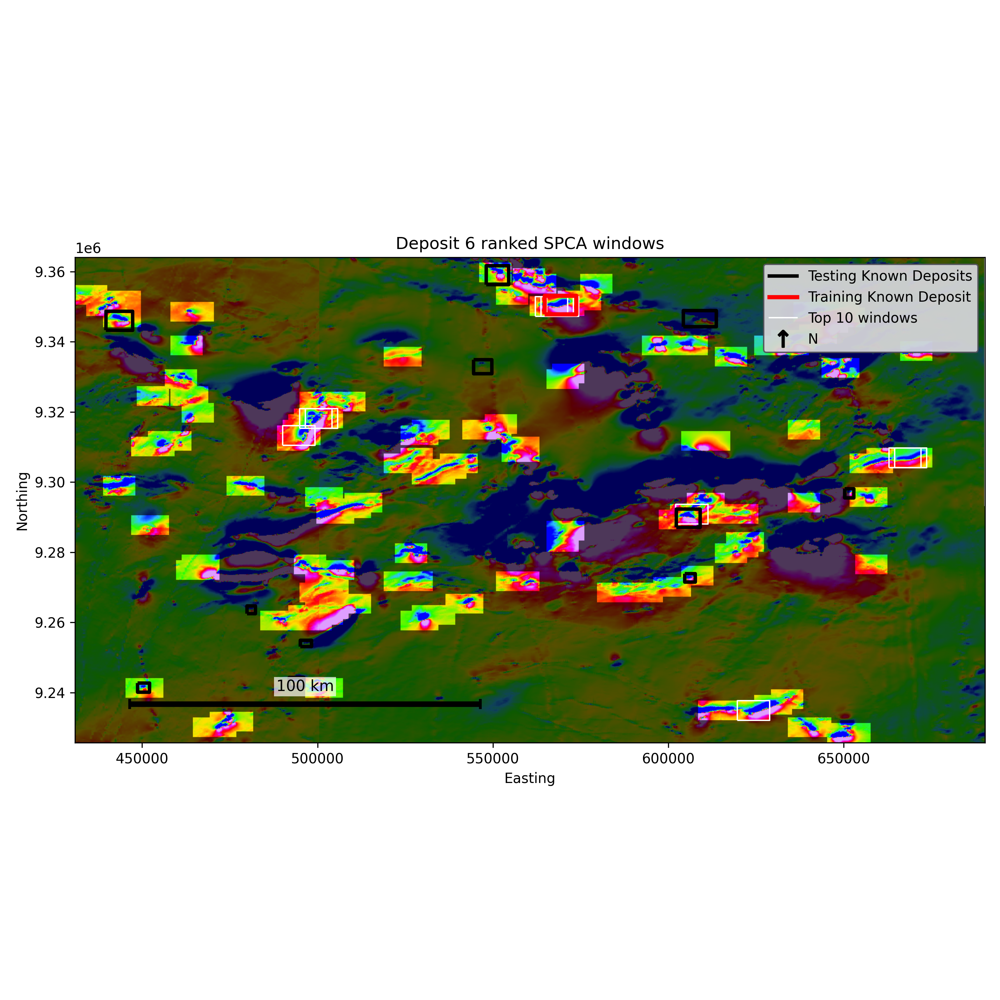

# Spatial PCA for Geophysical Pattern Recognition in Mineral Exploration

**A reproducible method repository with an application to Carajas IOCG deposits**

This repository contains a reusable Spatial Principal Component Analysis
(Spatial PCA) workflow for geophysical pattern recognition in mineral
exploration. The main application is the Carajas, Brazil IOCG case study from
the paper:

> Multiphysics Geophysical Pattern Recognition for Mineral Exploration using
> Spatial Principal Component Analysis: Case Study of Carajas, Brazil Using IOCG
> Deposits

The repository is organized as a method repository. The Carajas case study is
the primary reproducible application, but the workflow is designed so it can be
adapted to other mineral exploration datasets by editing configuration files.

## What the Method Does

Spatial PCA learns the geophysical geometry of a known deposit and ranks other
locations in the study area by how closely their local geophysical patterns
match that deposit. The workflow:

1. Samples the study area using sliding windows.
2. Extracts a training window from a selected known deposit.
3. Fits spatial PCA to windowed geophysical data.
4. Uses deposit-specific PC weights to emphasize PCs important to the training
   deposit.
5. Ranks candidate windows by deposit-weighted similarity.
6. Validates rankings against other known deposits using footprint recovery and
   hit metrics.

This is useful when the target signature is not just a high or low anomaly, but
a spatial arrangement of geophysical responses around a known mineralized
system.

## Repository Layout

```text
Spatial_PCA_Multivariate_Repo/
├── README.md
├── environment.yml
├── requirements.txt
├── configs/
│   ├── carajas_uni_tmi.yaml
│   ├── carajas_multi_tmi_u.yaml
│   └── template_project.yaml
├── src/spatial_pca/
│   ├── config.py
│   ├── pipeline.py
│   ├── spca/
│   ├── geodata/
│   └── validation/
├── scripts/
│   ├── run_carajas_univariate.py
│   ├── run_carajas_multivariate.py
│   └── run_project_from_config.py
├── data/
│   └── Illustrative Example Input Data/
├── notebooks/
│   ├── 00_illustrative_synthetic_demo.ipynb
│   ├── 01_carajas_univariate_demo.ipynb
│   └── 02_carajas_multivariate_demo.ipynb
├── outputs/
└── docs/figures/
```

Large rasters, shapefiles, and private project data should live outside this
GitHub repository. Point the config files to those external files.

## Installation

Using conda:

```bash
conda env create -f environment.yml
conda activate spatial-pca
```

Using pip:

```bash
python3 -m venv .venv
.venv/bin/python -m pip install --upgrade pip
.venv/bin/python -m pip install -r requirements.txt
```

For notebooks, also register the environment as a Jupyter kernel:

```bash
.venv/bin/python -m pip install ipykernel
.venv/bin/python -m ipykernel install --user --name spatial-pca-venv --display-name "Python (spatial-pca .venv)"
```

Then choose `Python (spatial-pca .venv)` as the notebook kernel. If you prefer
activating the environment first, run `source .venv/bin/activate`; after that,
`python` and `pip` refer to the `.venv` environment.

## Input Files

Each run config should provide:

- Geophysical raster paths, for example TMI and Radiometric U grids.
- A study area polygon for clipping the raster analysis domain.
- A deposits shapefile containing the training deposit and known validation
  deposits.
- CRS information, if raster CRS metadata needs to be repaired.
- Analysis settings such as stride, retained PCs, rotation angle, minimum
  footprint overlap, and output directory.

The reusable templates use variable-based raster paths:

```yaml
paths:
  variable_1_file_path: "/path/to/new_project/variable_1_grid.ers"
  variable_2_file_path: "/path/to/new_project/variable_2_grid.ers"
```

For local work, copy a config to `configs/local_*.yaml` and edit the paths
there. Local configs are ignored by Git. The Carajas application configs keep
the paper variable names (`TMI`, `Radiometric_U`) for readability.

## Case 1: Paulo Afonso / Deposit 6, Univariate TMI

This demo trains on Deposit 6 using the TMI grid and retained Spatial PCA
components from the paper application.

```bash
python scripts/run_carajas_univariate.py --config configs/carajas_uni_tmi.yaml
```

Configuration: `configs/carajas_uni_tmi.yaml`

Key settings:

- Training deposit: Paulo Afonso / Deposit 6
- Analysis type: `Uni`
- Variable: `TMI`
- Retained PCs: `17`
- Validation: footprint recovery against other known Carajas deposits

## Case 2: Alemao / Deposit 3, Multivariate TMI + Radiometric U

This demo trains on Deposit 3 using a multivariate TMI + Radiometric U workflow.
It uses the two-stage fused PCA ranking path and validates candidate windows
against known deposits with relevant magnetic and radiometric geometry.

```bash
python scripts/run_carajas_multivariate.py --config configs/carajas_multi_tmi_u.yaml
```

Configuration: `configs/carajas_multi_tmi_u.yaml`

Key settings:

- Training deposit: Alemao / Deposit 3
- Analysis type: `Multi`
- Variables: `TMI`, `Radiometric_U`
- Fused retained PCs: `17`
- Per-variable retained PCs: `TMI = 2`, `Radiometric_U = 34`
- Validation: footprint recovery against known Carajas deposits

## Synthetic Illustrative Example

For a lightweight demo that does not need external geophysical files, open:

```text
notebooks/00_illustrative_synthetic_demo.ipynb
```

The notebook uses tracked input files in
`data/Illustrative Example Input Data/` and calls the repository Spatial PCA
functions directly. Outputs are written to `outputs/Illustrative_Example/`.
Known-deposit labels in this example are the sliding-window IDs throughout the
notebook, figures, and CSV outputs.

The illustrative outputs include:

- `toy_example_grid_x.png`: annotated grid-to-window-matrix schematic.
- `toy_example_known_deposit_windows.png`: training and testing deposit windows
  on the synthetic grid, plus exact testing-deposit window chips.
- `deposit_scores_and_weights.png`: deposit-specific SPCA scores and weights.
- `loading_maps.png`: illustrative SPCA loading maps generated with the same
  `plot_loading_maps` helper used by the real-case pipeline.
- `score_pairs.png`: SPCA score-pair diagnostic colored by distance to the
  training deposit. By default, `plot_score_pairs` walks through adjacent PCs
  in descending weight order, highlights the configured top-ranked windows,
  and also accepts manual `pc_pairs`.
- `Synthetic_GP_Top_5_Predicted_Windows.png`: top-ranked windows over the
  synthetic grid. The overlay function can annotate training, testing, and
  predicted window IDs and accepts separate line widths for each boundary type.
- `cum_curve_unique_dep_hits.png`: cumulative footprint recovery. The companion
  `illustrative_known_deposit_recovery.csv` includes the overlapped testing
  known-deposit IDs by rank.
- `top_windows_and_recovery.png`: final two-panel summary with the top-window
  overlay on the left and cumulative recovery on the right.

The notebook-specific glue lives in
`src/spatial_pca/examples/illustrative.py` so the notebook can stay focused on
hardcoded example inputs and calls to the shared SPCA, ranking, plotting, and
validation functions.

## Run Any Project From Config

Start from the template that matches the analysis:

```bash
cp configs/template_univariate_project.yaml configs/local_my_univariate_project.yaml
cp configs/template_multivariate_project.yaml configs/local_my_multivariate_project.yaml
```

Edit the copied file's variable names, `paths.variable_1_file_path`,
`paths.variable_2_file_path` for multivariate runs, deposit paths, CRS, training
deposit ID, retained PCs, stride, rotation angle, and output directory. The
univariate template intentionally omits `analysis_defaults.variable_2`,
`analysis_defaults.vmin_var2`, `analysis_defaults.vmax_var2`, and
`paths.variable_2_file_path`.
Use `targets.deposit_crs_policy: "reproject_to_raster"` for normal projects.
Use `"assume_raster"` only for legacy datasets whose vector coordinates already
match the raster grid even though the shapefile CRS metadata differs.
`targets.validation_deposit_crs_policy` can be set separately when you need to
extract the training template with one CRS policy but validate known-deposit
footprints with another.
Then run:

```bash
python scripts/run_project_from_config.py --config configs/local_my_univariate_project.yaml
```

To run the Carajas univariate TMI config from the repo root:

```bash
.venv/bin/python scripts/run_project_from_config.py --config configs/carajas_uni_tmi.yaml
```

To run the Carajas multivariate TMI + Radiometric U config:

```bash
.venv/bin/python scripts/run_project_from_config.py --config configs/carajas_multi_tmi_u.yaml
```

Set `visualization.score_pairs_top_n_to_plot` to control how many top-ranked
windows are highlighted in `score_pairs.png`; use `0` to disable the overlay.

For a multivariate project, set `run.analysis_type` to `Multi`, set
`analysis_defaults.variable_1` and `analysis_defaults.variable_2`, and either
provide direct `best_kpcs_files.var1_kpcs` / `best_kpcs_files.var2_kpcs` values
or point the config to supporting best-k CSV files.

## Outputs

Each case writes a run folder under `outputs/`, including:

- `top_windows.gpkg`: ranked sliding-window geometries.
- `<variables>_Top_<N>_Predicted_Windows.png`: map of top-ranked windows.
- `top_similar_windows.png`: image chips for top-ranked windows.
- `pc_score_map.png`: PCA score diagnostic map.
- `score_pairs.png`: PCA score-pair diagnostic; highlighted open circles mark
  the top-ranked windows selected by `visualization.score_pairs_top_n_to_plot`.
- `component_weights.png`: deposit-specific PC weights.
- `cumulative_footprint_recovery_fraction.png`: validation curve.
- `validation_topk_results.pkl`: validation payload.
- `run_config_resolved.json` and `run_provenance.json`: reproducibility records.

Generated outputs are ignored by Git except for the placeholder
`outputs/.gitkeep`.

## Example Figure



Example output from the Carajas univariate TMI application. The map shows the
top-ranked sliding windows whose geophysical geometry most closely matches the
training deposit geometry.

## GitHub Repository

Remote repository name:

```text
Spatial_PCA_Multivariate_Repo
```

Repository URL:

```text
https://github.com/sofia-mantilla/Spatial_PCA_Multivariate_Repo.git
```
