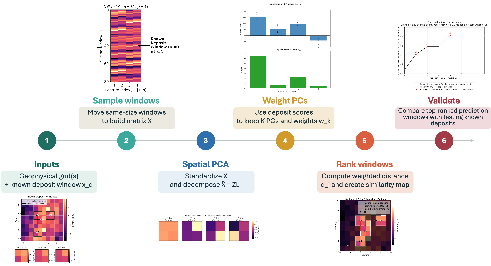

# Spatial PCA for Geophysical Pattern Recognition in Mineral Exploration

<p align="center">
  
  
  
  
  
</p>

## Why

Mineral exploration targeting requires high-stakes decisions under uncertainty: companies must decide where to acquire more data or drill long before they know whether a prospect can become an economic mine. Because only a small fraction of prospects ultimately become viable mines, poor early targeting can lead to costly investment in areas with limited economic potential. This makes it important to extract as much useful information as possible from the limited evidence available. In many districts, only a few deposits are known, so this workflow uses each known deposit not only as a labeled location, but as a spatial geophysical signature. It learns the deposit’s geophysical geometry and ranks other areas by how closely they reproduce that geometry.

**Real-world solution:** rank areas whose geophysical geometry resembles a known
deposit, so exploration teams can prioritize follow-up targets more
systematically.

**Keywords:** mineral exploration, Spatial PCA, geophysics, TMI, radiometrics,
sliding windows, IOCG deposits, Carajas, footprint recovery.

<p align="center">
  
</p>

<p align="center">
  <strong>Real case result using public TMI data in Carajas, Brazil. Spatial PCA ranks geophysical windows learning the training deposit’s geophysical geometry and ranks other areas by how closely they reproduce that geometry..</strong>
</p>

## What

This repository provides a config-driven Spatial PCA workflow for building a
similarity map and target ranking from geophysical rasters. It moves
deposit-sized windows across the study area, represents each window with PCA
scores, weights the components most characteristic of the training deposit, and
validates the top-ranked windows against independent deposit footprints.

<p align="center">
  
</p>

**Module core functionality**

- Load geophysical rasters and deposit polygons from config files.
- Crop rasters, rotate deposit templates, and build sliding windows.
- Flatten windows into a Spatial PCA matrix.
- Rank candidate windows by PCA-space similarity to a selected training deposit.
- Export top-window maps, diagnostic figures, GeoPackage outputs, run configs,
  and provenance files.
- Validate top-ranked windows with cumulative footprint-recovery metrics.

**Current release scope**

- Ready in this first public version: synthetic demo notebooks and the
  univariate Carajas Spatial PCA workflows for TMI and Radiometric U.
- In progress for the next version: multivariate TMI + Radiometric U fusion.
  The repository still names the multivariate configs, notebooks, and code path
  for transparency, but multivariate fusion is not considered validated in this
  release.

## Authors and Contact

**Author:** Sofia Mantilla Salas<br>
**Affiliation:** Stanford Mineral-X<br>
**Repository:** <https://github.com/sofia-mantilla/spatial-pca-geophysical-pattern-recognition>

For questions, open a GitHub issue or contact the maintainer through the GitHub
profile linked above.

## How

### Getting Started

#### Installation Guide

Clone the repository and create the Conda environment:

```bash
git clone https://github.com/sofia-mantilla/spatial-pca-geophysical-pattern-recognition.git
cd Spatial_PCA_Multivariate_Repo
conda env create -f environment.yml
conda activate spatial-pca
```

If you prefer `pip`, install the Python dependencies directly:

```bash
python -m pip install -r requirements.txt
```

The scripts add `src/` to the Python path automatically, so an editable package
install is not required for the current workflow.

### Run a Demo

The synthetic example is the safest public demo because it uses small test data
included with the repository:

```bash
python -m pip install notebook
jupyter notebook notebooks/00_illustrative_synthetic_demo.ipynb
```

To run the Carajas univariate TMI workflow after placing the required geospatial
data under `data/`, use:

```bash
python scripts/run_project_from_config.py --config configs/carajas_uni_tmi.yaml
```

or the convenience script:

```bash
python scripts/run_carajas_univariate.py
```

You can override the training deposit, retained PC count, output directory, or
top-window count from the command line:

```bash
python scripts/run_project_from_config.py \
  --config configs/carajas_uni_tmi.yaml \
  --deposit 3 \
  --kpcs 17 \
  --top-k 250
```

### Input Data

Inputs are controlled by YAML files in `configs/`.

- Raster grids: geophysical rasters readable by `rasterio`; the Carajas configs
  use `.ers` grids.
- Deposit polygons: ESRI Shapefile or GeoPackage polygons for training and
  validation deposits.
- Optional crop polygons: polygons used to restrict the analysis area.
- Config metadata: selected variables, training deposit ID, rotation angle,
  stride, retained PCs, validation threshold, and output naming.

Per the Mineral-X GitHub protocol, large geospatial data should be stored in an
approved external drive or cloud location, not committed to GitHub. This repo is
structured so those files can be copied locally into `data/` while remaining
ignored by Git.

### Output Data

Each run writes a self-contained output folder under `outputs/`.

- `top_windows.gpkg`: ranked prediction windows as geospatial polygons.
- `*_Top_250_Predicted_Windows.png`: map of top-ranked windows.
- `top_similar_windows.png`: image chips for selected top windows.
- `pc_score_map.png`: PCA score diagnostic map.
- `score_pairs.png`: score-pair diagnostic plots.
- `component_weights.png`: deposit-specific PC weights.
- `cumulative_footprint_recovery_fraction.png`: validation recovery curve.
- `validation_topk_results.pkl`: validation metrics and metadata.
- `run_config_resolved.json`: fully resolved run configuration.
- `run_provenance.json`: reproducibility metadata.

Generated outputs are ignored by Git except for `outputs/.gitkeep`.

## Repo Tree

```text
.
|-- configs/                 # YAML configs for reusable project runs
|-- data/                    # Local data staging area; large files are ignored
|-- docs/figures/            # README figures and workflow graphics
|-- notebooks/               # Demo notebooks and case-study notebooks
|-- outputs/                 # Generated run outputs; ignored except .gitkeep
|-- scripts/                 # Command-line entry points
|-- src/spatial_pca/         # Spatial PCA source code
|   |-- geodata/             # Raster, vector, and export utilities
|   |-- spca/                # Window extraction, PCA, and ranking logic
|   |-- validation/          # Footprint-recovery validation tools
|   |-- config.py            # Config loading and normalization
|   |-- pipeline.py          # End-to-end workflow driver
|   `-- provenance.py        # Run provenance records
|-- environment.yml          # Conda environment
|-- requirements.txt         # pip dependency list
`-- README.md
```

## Method Summary

1. Select a training deposit and geophysical variable from the config.
2. Crop and prepare the raster data.
3. Extract the selected deposit polygon and rotate the deposit template if
   requested.
4. Slide a template-sized window across the raster grid.
5. Flatten each valid window into a Spatial PCA feature vector.
6. Append the training deposit template as the reference row.
7. Fit PCA, rank all windows by weighted PCA-space distance to the deposit, and
   export the top windows.
8. Validate the ranked windows by measuring cumulative recovery of known deposit
   footprints outside the training deposit.

## Project Status

This repository is prepared for a first public release focused on the validated
univariate Spatial PCA workflow. The multivariate workflow is visible in the
repository because it is part of the research direction, but it is currently
marked as in progress and will be released as a validated workflow in a later
version.

Before final publication, the remaining Mineral-X release checklist items are:

- Add approved external links for any non-GitHub data distribution.
- Complete the assigned Mineral-X code review.
- Publish the code with the associated paper or preprint when ready.

## License / Licence

This project is released under the MIT License. See [LICENSE](LICENSE).

## Citation

Citation information is pending. When citing this repository before a formal
paper release, please cite the GitHub repository and include the commit hash used
for reproducibility.
