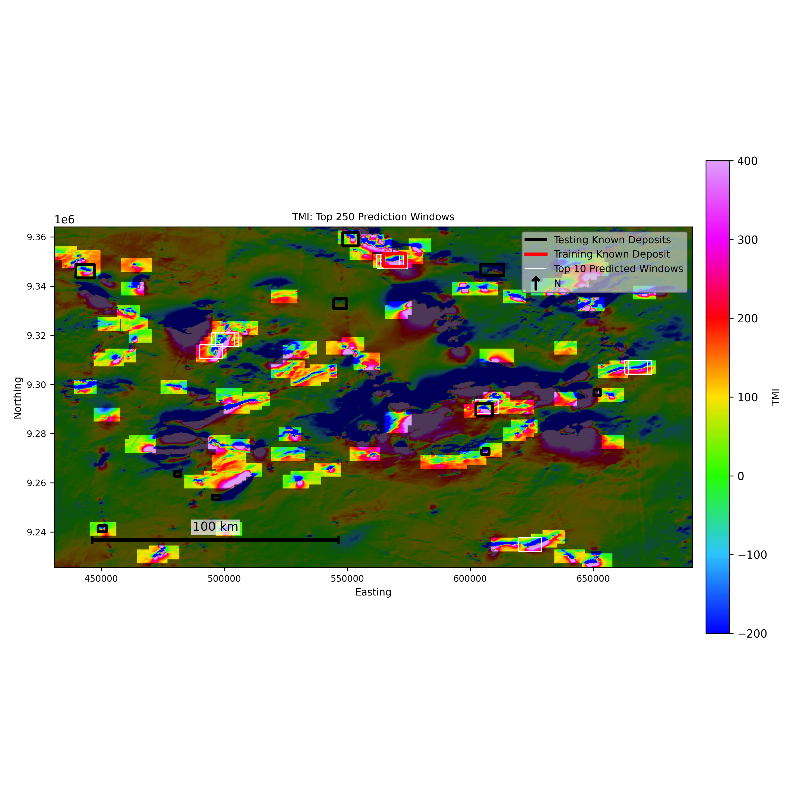
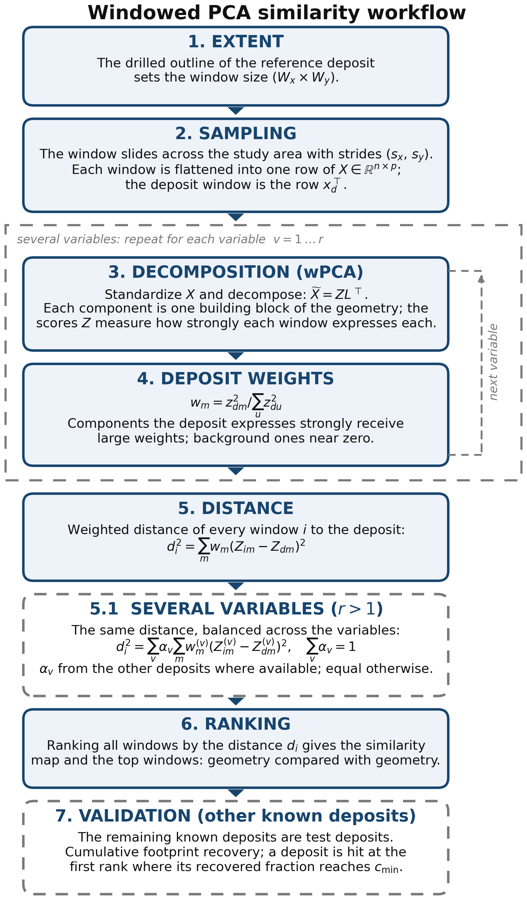
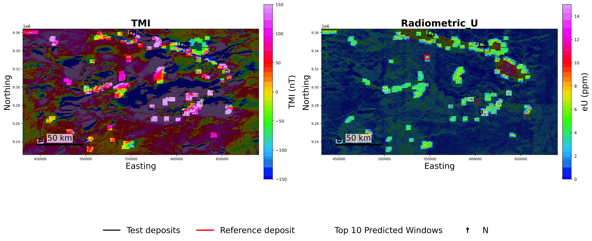
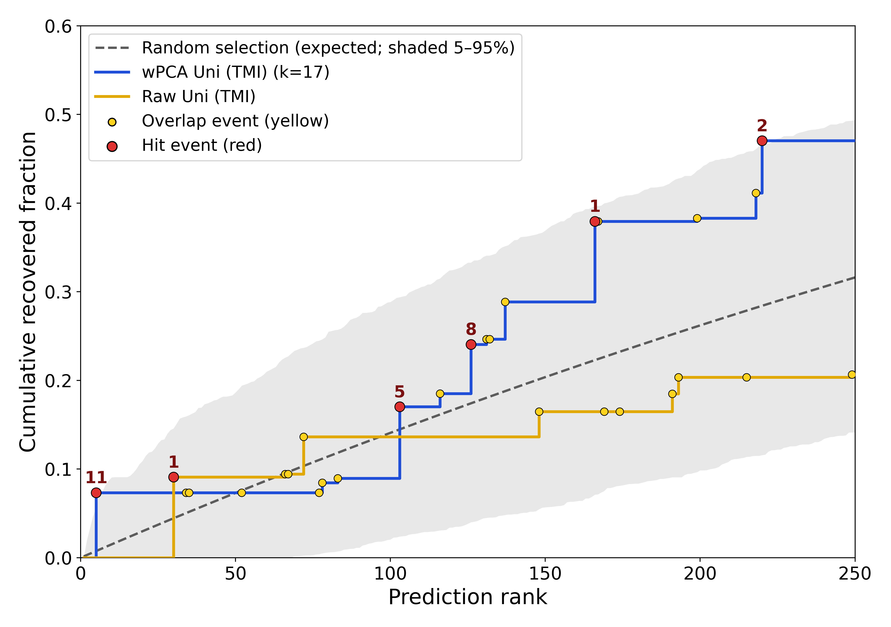
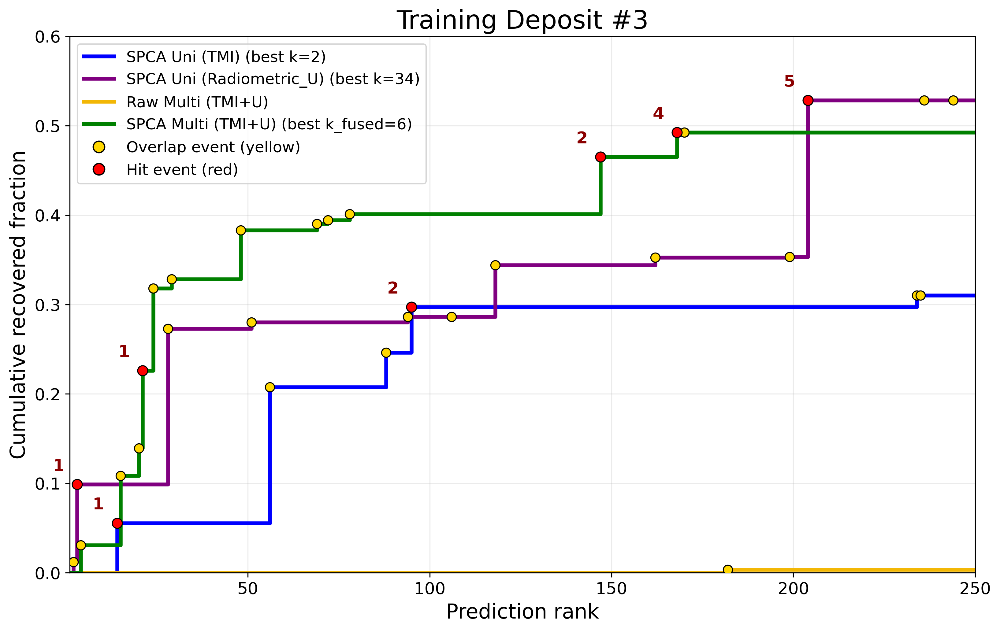

# Windowed PCA (wPCA) for Geophysical Pattern Recognition in Mineral Exploration

<p align="center">
  
  
  
  
  
</p>

[](https://doi.org/10.5281/zenodo.20168910)

This repository accompanies the paper:

> Mantilla Salas, S., Mejia-Herrera, P., Kloeckner, J., Asadi, A., Yin, D. Z., & Caers, J. (2026).
> *Geometry-based targeting from a single known deposit using windowed principal
> component analysis: an IOCG case study in Carajás, Brazil.*
> Submitted to Natural Resources Research.

**Naming note.** The paper names the method **windowed PCA (wPCA)** to avoid
confusion with the spatially weighted PCA of Jombart et al. Earlier versions of
this repository (and the Python package name, `spatial_pca`) used the working
name "Spatial PCA" — same method, same code. Import paths and config names are
unchanged so existing links, imports, and the archived releases keep working.

## Why

Mineral exploration targeting requires high-stakes decisions under uncertainty:
companies must decide where to acquire more data or drill long before they know
whether a prospect can become an economic mine. Because only a small fraction of
prospects ultimately become viable mines, poor early targeting can lead to
costly investment in areas with limited economic potential. In many districts
only a few deposits are known, so this workflow uses each known deposit not
only as a labeled location, but as a spatial geophysical signature: it learns
the deposit's geophysical geometry and ranks all other areas by how closely
they reproduce that geometry.

**Real-world solution:** rank areas whose geophysical geometry resembles a known
deposit, so exploration teams can prioritize follow-up targets more
systematically.

**Keywords:** mineral exploration, windowed PCA, wPCA, geophysics, TMI,
radiometrics, sliding windows, IOCG deposits, Carajás, footprint recovery.

<p align="center">
  
</p>

<p align="center">
  <strong>Case 1 result with public TMI data in Carajás, Brazil: wPCA learns the reference deposit's geophysical geometry and ranks other areas by how closely they reproduce it.</strong>
</p>

## What

This repository provides a config-driven wPCA workflow for building a
similarity map and target ranking from geophysical rasters. It moves
deposit-sized windows across the study area, represents each window with PCA
scores, weights the components most characteristic of the reference deposit,
and validates the top-ranked windows against independent deposit footprints.

<p align="center">
  
</p>

**Module core functionality**

- Load geophysical rasters and deposit polygons from config files.
- Crop rasters, rotate deposit templates, and build sliding windows.
- Flatten windows into a wPCA feature matrix.
- Rank candidate windows by PCA-space similarity to a selected reference
  deposit, univariate or multivariate (score concatenation with a balance
  weight between variables).
- Export top-window maps, diagnostic figures, GeoPackage outputs, run configs,
  and provenance files.
- Validate top-ranked windows with cumulative footprint-recovery metrics
  against an exact random-selection expectation of equal area.

**Release scope (paper release)**

- **Case 1 — univariate TMI** (reference: Paulo Afonso deposit): validated.
  The ranking recovers 47% of the test-deposit footprints in the top 250
  windows, about three times the expectation of a random selection of equal
  area.
- **Case 2 — multivariate TMI + radiometric U** (reference: Alemão deposit):
  validated. The combination recovers 64% of the test-deposit footprints and
  hits three of four test deposits, more than either variable alone.
- The scripts that reproduce the paper's numbers, tables, and figures live in
  [`paper/`](paper/) — see the [Reproducing the paper](#reproducing-the-paper)
  section.

<p align="center">
  
</p>

## Authors and Contact

**Sofia Mantilla Salas** — Stanford Mineral-X (corresponding; maintainer)<br>
**Pablo Mejia-Herrera** — NorthIsle Copper and Gold Inc.<br>
**Jonas Kloeckner** — Stanford Mineral-X<br>
**Adel Asadi** — Stanford Mineral-X<br>
**David Zhen Yin** — Stanford Mineral-X / Oxus Metals<br>
**Jef Caers** — Stanford Mineral-X<br>
**Repository:** <https://github.com/sofia-mantilla/spatial-pca-geophysical-pattern-recognition>

For questions, open a GitHub issue or contact the maintainer through the GitHub
profile linked above.

## How

### Getting Started

This repository is intended for Python 3.10 or newer. Check your Python version
before installing:

```bash
python3 --version
```

Clone the repository:

```bash
git clone https://github.com/sofia-mantilla/spatial-pca-geophysical-pattern-recognition.git
cd spatial-pca-geophysical-pattern-recognition
```

Option A, using Conda:

```bash
conda env create -f environment.yml
conda activate spatial-pca
```

If `conda` is not available, use Option B with a Python virtual environment:

```bash
python3.10 -m venv .venv
source .venv/bin/activate
python -m pip install --upgrade pip
python -m pip install -r requirements.txt
```

The scripts add `src/` to the Python path automatically, so an editable package
install is not required.

### Smoke Test

Run the bundled synthetic example to verify that the environment, imports,
input data, PCA, and ranking steps work:

```bash
python scripts/run_synthetic_smoke_test.py
```

Expected output begins with:

```text
smoke_test=PASS
field_shape=(10, 10)
window_matrix_shape=(82, 4)
top_5_window_indices=[40, 12, 52, 31, 48]
```

### What Can I Run?

If you are a new user, start with the smoke test above; it uses the small
synthetic dataset tracked in Git. After that, you can run:

- `notebooks/00_illustrative_synthetic_demo.ipynb`: full synthetic walkthrough
  with figures and validation outputs; no external data required.
- `python scripts/run_project_from_config.py --config configs/carajas_uni_tmi.yaml`:
  Carajás univariate TMI workflow (paper Case 1); requires the Carajás raster
  and polygon data from the public Drive folders below.
- `python scripts/run_project_from_config.py --config configs/carajas_multi_tmi_u.yaml`:
  Carajás multivariate TMI + radiometric-U workflow (paper Case 2 pipeline);
  requires both Carajás data folders.
- The scripts in [`paper/`](paper/): reproduce the paper's headline numbers,
  ablations, and figures (see below).

### Public Data Download

The Carajás geophysical grids and deposit polygons are distributed outside
GitHub through public Google Drive folders:

- [Carajas data folder 1 — univariate TMI](https://drive.google.com/drive/folders/18hYA0qJFTlSgdd5eHp6skI83oSaN17GG?usp=drive_link)
- [Carajas data folder 2 — multivariate TMI + radiometric U](https://drive.google.com/drive/folders/14FNE3kchMRP-kWrFQ4DcHXXANyEcVMq5?usp=drive_link)

After downloading, arrange the files so the config paths resolve like this:

```text
data/
|-- Carajas_Brazil_Univariate_TMI/
|   |-- 1097_1125_1129_TMI_merged.ers
|   |-- 1097_1125_1129_TMI_merged
|   |-- Demo_area_polygon.shp
|   `-- Prospect_in Carajas_v2.shp
|-- Carajas_Brazil_Multivariate_TMI_U/
|   |-- 1097_1125_1129_RAD_eU_merged.ers
|   |-- 1097_1125_1129_RAD_eU_merged
|   `-- Prospect_in Carajas_multi.shp
`-- naturalearth/          # small boundary files, tracked in the repo
```

Include the companion Shapefile sidecar files (`.dbf`, `.shx`, `.prj`, `.cpg`)
when present. The underlying geophysical surveys are public data from the
Geological Survey of Brazil (SGB/CPRM).

### Run Case 1 (univariate TMI)

```bash
python scripts/run_project_from_config.py --config configs/carajas_uni_tmi.yaml
```

(This takes about 25 seconds.) You can override the reference deposit, retained
PC count, output directory, or top-window count from the command line:

```bash
python scripts/run_project_from_config.py \
  --config configs/carajas_uni_tmi.yaml \
  --deposit 6 \
  --kpcs 17 \
  --top-k 250
```

### Run Case 2 (multivariate TMI + radiometric U)

```bash
python scripts/run_project_from_config.py --config configs/carajas_multi_tmi_u.yaml
```

The multivariate ranking concatenates each variable's standardized PC scores
(TMI k and U k retained per variable) with a balance weight between the
variables, then ranks windows in the combined score space. The paper's final
Case-2 numbers (reference Alemão, TMI k=2, U k=8, balance weight set from the
other deposits' univariate performance) are reproduced by
`paper/run_corrections.py`.

### Output Data

Each run writes a self-contained output folder under `outputs/`.

- `top_windows.gpkg`: ranked prediction windows as geospatial polygons.
- `*_Top_250_Predicted_Windows.png`: map of top-ranked windows.
- `top_similar_windows.png`: image chips for selected top windows.
- `pc_score_map.png`: PCA score diagnostic map.
- `score_pairs.png`: score-pair diagnostic plots.
- `component_weights.png`: deposit-specific PC weights.
- `cumulative_footprint_recovery_fraction.png`: validation recovery curve.
- `validation_topk_results.pkl`: validation metrics and metadata.
- `run_config_resolved.json`: fully resolved run configuration.
- `run_provenance.json`: reproducibility metadata.

Generated outputs are ignored by Git except for `outputs/.gitkeep`.

## Reproducing the paper

The [`paper/`](paper/) folder contains the analysis and figure scripts behind
the manuscript — replication gates for both cases, the exact random-selection
null, the appendix ablations, and every generated figure. See
[`paper/README.md`](paper/README.md) for the script-by-script map and
environment caveats. Validation results:

<p align="center">
  
</p>

<p align="center">
  
</p>

## Pipeline internals

For readers of the code, the multivariate path through the pipeline is:

```text
scripts/run_project_from_config.py
  -> spatial_pca.pipeline.run_spca_from_config()
     -> load_run_config() / _build_run_plan()
     -> run_multivariate_case()
        -> load_multivariate_rasters() -> load_variable_raster() -> load_raster()
        -> _validate_multivariate_rasters()
        -> _load_case_deposits()
        -> get_deposit_template()            # once per variable
        -> _resolve_multivariate_best_kpcs()
        -> run_spca_multi_ranking_pipeline()
           -> per-variable PCA scores        # keep Z[:, :k] per variable
           -> horizontal concatenation       # including the reference window row
           -> combined ranking               # balance weight between variables
           -> rank_spca_windows()
        -> build_top_windows_gdf() -> save_geopackage()
        -> validate_footprint_recovery() -> write_validation_payload()
        -> plot diagnostics
```

The univariate path is the same with a single variable and no concatenation.

## Repo Tree

```text
.
|-- configs/                 # YAML configs for reusable project runs
|-- data/                    # Local data staging area; large files are ignored
|-- docs/figures/            # README figures
|-- notebooks/               # Demo notebooks and case-study notebooks
|-- outputs/                 # Generated run outputs; ignored except .gitkeep
|-- paper/                   # Paper replication + figure scripts (see paper/README.md)
|-- scripts/                 # Command-line entry points
|   |-- run_synthetic_smoke_test.py
|-- src/spatial_pca/         # wPCA source code (package name kept for continuity)
|   |-- geodata/             # Raster, vector, and export utilities
|   |-- spca/                # Window extraction, PCA, and ranking logic
|   |-- validation/          # Footprint-recovery validation tools
|   |-- config.py            # Config loading and normalization
|   |-- pipeline.py          # End-to-end workflow driver
|   |-- units.py             # Physical units for figure labels
|   `-- provenance.py        # Run provenance records
|-- environment.yml          # Conda environment
|-- requirements.txt         # pip dependency list
`-- README.md
```

## Method Summary

1. Select a reference deposit and one or more geophysical variables from the
   config.
2. Crop and prepare the raster data.
3. Extract the reference deposit polygon and rotate the deposit template if
   requested.
4. Slide a template-sized window across the raster grid.
5. Flatten each valid window into a wPCA feature vector (per variable).
6. Append the reference deposit template as the reference row.
7. Fit PCA per variable, keep each variable's leading components, and — in the
   multivariate case — concatenate the standardized scores with a balance
   weight between variables.
8. Rank all windows by weighted PCA-space distance to the reference deposit
   and export the top windows.
9. Validate the ranked windows by measuring cumulative recovery of known
   deposit footprints outside the reference deposit, against the exact
   expectation of a random selection of equal area.

## License / Licence

This project is released under the MIT License. See [LICENSE](LICENSE).

## Citation

If you use this repository, please cite both the paper and the archived
software release:

**Paper**

> Mantilla Salas, S., Mejia-Herrera, P., Kloeckner, J., Asadi, A., Yin, D. Z.,
> & Caers, J. (2026). Geometry-based targeting from a single known deposit
> using windowed principal component analysis: an IOCG case study in Carajás,
> Brazil. Submitted to Natural Resources Research.

**Software**

> Mantilla Salas, S. (2026). *Windowed PCA (wPCA) for Geophysical Pattern
> Recognition in Mineral Exploration* (v2.0.0). Zenodo.
> https://doi.org/10.5281/zenodo.20168910

See [`CITATION.cff`](CITATION.cff) for machine-readable metadata; the Zenodo
badge above always resolves to the latest archived version.
